<p align="center">
  
</p>

<p align="center">
  <a href="https://www.mohammedadil.tech">
    
  </a>
  <a href="https://www.linkedin.com/in/mohammed-adil-h/">
    
  </a>
  <a href="mailto:mohammed.dev43@gmail.com">
    
  </a>
  <a href="https://www.mohammedadil.tech/assets/mohammed_adil_resume.pdf">
    
  </a>
</p>

<br/>

## About

I build and ship production Flutter apps end to end — first sketch to store release. Three-plus years across logistics, healthcare, and education, at four companies.

```dart
const mohammed = Developer(
  role:      'Flutter Developer',
  location:  'Dubai, UAE',
  shipped:   ['ProFast', 'Pharmaly', 'Student Portal', 'Dash School'],
  stack:     ['Clean Architecture', 'BLoC', 'Dio', 'GetIt', '.NET Core'],
  degree:    'B.Sc. Software Engineering',
  openTo:    ['Full-time', 'Freelance', 'Remote'],
);
```

- **6 apps live** on Google Play and the App Store
- **Clean Architecture** with **BLoC/Cubit**, backed by unit and widget tests
- I write the backend too — **.NET Core Web APIs in C#**, shipped in production
- **CI/CD** pipelines to TestFlight and Play Console, with Crashlytics monitoring

<br/>

## Shipped apps

<table>
  <tr>
    <td width="50%" valign="top">
      <h3>🚚 ProFast <sub><em>Logistics</em></sub></h3>
      <p>Client and driver delivery apps — live order tracking on Google Maps, in-app payments, push notifications.</p>
      <p><code>Flutter</code> <code>BLoC</code> <code>Dio</code> <code>Google Maps</code> <code>FCM</code></p>
      <p>
        <a href="https://play.google.com/store/apps/details?id=net.msc.faster"></a>
        <a href="https://apps.apple.com/ae/app/profast/id6466286769"></a><br/>
        <a href="https://play.google.com/store/apps/details?id=net.msc.faster_driver"></a>
        <a href="https://apps.apple.com/us/app/profast-driver/id6468775134"></a>
      </p>
    </td>
    <td width="50%" valign="top">
      <h3>💊 Pharmaly <sub><em>Healthcare</em></sub></h3>
      <p>B2B platform connecting pharmacies with suppliers — catalog, ordering, order status, in-app messaging.</p>
      <p><code>Flutter</code> <code>BLoC</code> <code>Dio</code> <code>GetIt</code> <code>Firebase</code></p>
      <p>
        <a href="https://play.google.com/store/apps/details?id=net.themsc.pharmaly.client"></a>
        <a href="https://apps.apple.com/us/app/pharmaly/id6503078846"></a><br/>
        <a href="https://play.google.com/store/apps/details?id=net.themsc.pharmaly.supplier"></a>
        <a href="https://apps.apple.com/us/app/pharmaly-supplier/id6503060949"></a>
      </p>
    </td>
  </tr>
  <tr>
    <td width="50%" valign="top">
      <h3>🎓 Student Portal <sub><em>Education</em></sub></h3>
      <p>University app for schedules, exams, fee payments, and notifications. <strong>Flutter front end on .NET Core Web APIs I built myself.</strong></p>
      <p><code>Flutter</code> <code>Clean Architecture</code> <code>.NET Core</code> <code>C#</code> <code>FCM</code></p>
      <p>
        <a href="https://play.google.com/store/apps/details?id=com.edu_pro.studentportal"></a>
      </p>
    </td>
    <td width="50%" valign="top">
      <h3>🏫 Dash School <sub><em>Education</em></sub></h3>
      <p>Parent companion app — class schedules, exam timetables, results, and tuition fees in one place.</p>
      <p><code>Flutter</code> <code>BLoC</code> <code>REST APIs</code></p>
      <p>
        <a href="https://play.google.com/store/apps/details?id=com.schoolmanagement.dash"></a>
      </p>
    </td>
  </tr>
</table>

<br/>

## Tech stack

<p align="center">
  
</p>
<p align="center">
  
</p>

<details>
<summary><b>Full breakdown</b></summary>
<br/>

**Mobile** — Flutter · Dart · BLoC/Cubit · Provider · Dio · GetIt · Firebase (Auth, FCM, Crashlytics) · Google Maps · Local databases · Responsive & adaptive design

**Architecture** — Clean Architecture · MVVM · SOLID · Design patterns · Unit & widget testing

**Backend** — C# · .NET Core Web API · RESTful APIs · MySQL

**Delivery** — Git/GitHub · CI/CD pipelines · Play Console · App Store Connect · Agile/Scrum

</details>

<br/>

## Open source

<table>
  <tr>
    <td width="33%" valign="top"><a href="https://github.com/mohammed-xp/fruit_hub"><b>fruit_hub</b></a><br/><sub>E-commerce app for fresh produce — auth, cart, checkout, order tracking.</sub><br/><br/><sub><code>Firebase</code> <code>Cubit</code> <code>Clean Arch</code></sub></td>
    <td width="33%" valign="top"><a href="https://github.com/mohammed-xp/fruit_hub_dashboard"><b>fruit_hub_dashboard</b></a><br/><sub>Admin dashboard for fruit_hub — product and order management.</sub><br/><br/><sub><code>Flutter Web</code> <code>Firebase</code></sub></td>
    <td width="33%" valign="top"><a href="https://github.com/mohammed-xp/bookly"><b>bookly</b></a><br/><sub>Book discovery app built on the Google Books API.</sub><br/><br/><sub><code>Dio</code> <code>Cubit</code></sub></td>
  </tr>
</table>

<br/>

## Currently

At **ProFast**, owning the client and driver apps on both stores. Deepening the backend side with ASP.NET Core and EF Core, and picking up React — aiming at full-stack.

<p align="center">
  
</p>

<br/>

<p align="center">
  <b>Open to full-time and freelance work — Dubai or remote.</b><br/>
  <sub>
    <a href="https://www.mohammedadil.tech">Portfolio</a> ·
    <a href="https://www.linkedin.com/in/mohammed-adil-h/">LinkedIn</a> ·
    <a href="mailto:mohammed.dev43@gmail.com">Email</a>
  </sub>
</p>
